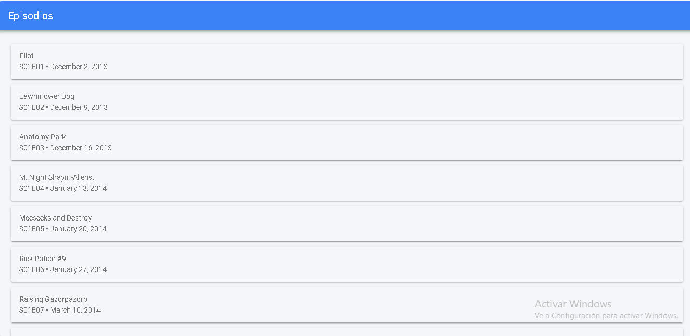

Actividad 4 – Consumo de GraphQL

En esta actividad se implementó el consumo de la API GraphQL de Rick and Morty utilizando HttpClient en Ionic.

Primero se realizó una consulta para obtener el listado de episodios, mostrando el nombre, el código del episodio y la fecha de emisión en la pantalla principal.

Luego se implementó una consulta más completa que se ejecuta cuando el usuario selecciona un episodio. En esta consulta se envía el id como variable y se obtiene la información detallada del episodio junto con los personajes que aparecen en él.

Para la consulta compleja se decidió solicitar únicamente los datos necesarios para la interfaz.
Del episodio se solicitaron:

-nombre

-código

-fecha

Y de los personajes:

-nombre

-estado

-especie

-imagen

Esto permitió reducir la cantidad de datos recibidos y hacer la aplicación más eficiente.
La información detallada se muestra en un modal, permitiendo al usuario ver los personajes sin salir de la lista principal.

